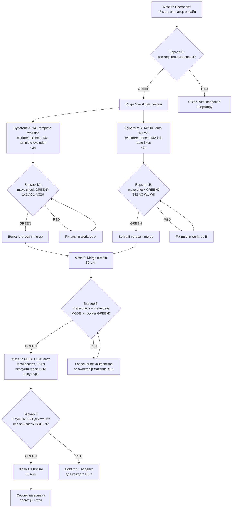

# 142-full-auto-cycle — 02-MetaDevPlan-E2E.md

$START_METADEVPLAN

$ARTIFACT_CONTRACT
PURPOSE:               Отдельный план интеграционного end-to-end тестирования полного цикла платформы после выполнения 141-template-evolution (доработка шаблонов) и 142 W1-W9 (автоматизация ручных действий). Оркестрация ночной автономной сессии: 2 параллельных worktree-субагента (141+142) → барьер make check + merge → 1 local-субагент (META+E2E-тест). Не дублирует 01-DevPlan — потребляет его результаты как given.
DESCRIPTION:           Трёхфазная оркестрация: Фаза 1 (параллельные worktree, ~3ч) — субагент A выполняет 141-template-evolution (02+03), субагент B — 142 W1-W9; Фаза 2 (барьер, ~30мин) — merge обеих веток в main, make check GREEN, artifacts preserved; Фаза 3 (local-сессия, ~2.5ч) — META-верификация интеграции (141 шаблоны + 142 self-heal) на переустановленном tronyx-vps, финальный промт повторного прогона. Бюджет: 6 часов, 2 параллельных + 1 последовательный субагент. Все вопросы оператора — в префлайте (принцип «все вопросы сейчас, а не потом»).
RATIONALE:             Пользователь явно выбрал (ответ Q2): META = «Отдельный план E2E-теста». 141-template-evolution и 142 W1-W9 — независимые домены (templates/ vs core/ + node-configs/ + bootstrap/), допускают параллельную реализацию в worktree-сессиях (ответ Q3: «Фазы с барьерами»). Оркестрация в субагентах предотвращает смешение контекста и исчерпание context window на длинной ночной сессии. Тестирование полного цикла на переустановленном tronyx-vps (ответ Q8) — реальный сценарий «голый сервер → full-auto → GREEN». Промт — чистый агент-промт без нового make-таргета (ответ Q10).
ACCEPTANCE_CRITERIA:   (1) Фаза 1: обе ветки слиты в main без конфликтов скоупа; (2) Фаза 2: make check GREEN, make gate MODE=fast GREEN (pre-push hook), make templates-check GREEN, make gate MODE=ci-docker GREEN (142 W8); (3) Фаза 3: прогон на переустановленном tronyx-vps — 0 ручных SSH-действий (142 AC2), все 6 пунктов чек-листа 142 Приложение А пройдены; chaos-сьют T1-T11 — все критичные (B18-B26 ветка) GREEN или явный Debt с ETA; L1 build non-blocking (PAT-решение); (4) Финальный промт (§7) готов к запуску следующего (4-го) прогона как одного действия; (5) Отчёты (02-VerificationReport, 04-TimingsReport, 05-TelegramSummary) созданы в .ai/plans/142-full-auto-cycle/.
IMPLEMENTS:            Решения оператора по 10 опросным вопросам (2026-08-06); 141-template-evolution/01-Brief+02-DevPlan+03-MetaDevPlan; 142-full-auto-cycle/01-DevPlan W1-W9.
IMPACTS:               .ai/plans/142-full-auto-cycle/ (новые артефакты: 02-MetaDevPlan-E2E.md — настоящий; 03-VerificationReport.md, 04-TimingsReport.md, 05-TelegramSummary.md — после прогона); git branches (142-template-evolution, 142-full-auto-fixes); tronyx-vps (переустановка + полный цикл); Agent Manager (2 worktree + 1 local сессии).
REQUIRES:              (1) node-configs/tronyx-vps/node.yaml содержит node.ci_root_key (142 Q1) и owner_key; (2) AGE_SECRET_KEY в GitHub Secrets репо; (3) S3-кеш сертификатов tronyx-vps-backups bucket жив; (4) TELEGRAM_BOT_TOKEN + TELEGRAM_CHAT_ID в enc.yaml; (5) webnames API key (для новых доменов при отсутствии S3-кеша); (6) оператор доступен первые 15 минут сессии для батча вопросов; (7) эксклюзивность tronyx-vps на 8 часов.
$END_ARTIFACT_CONTRACT

---

## 0. Контекст и позиционирование

### 0.1 Что уже есть (given — не создаётся заново)

| План | Статус | Что покрывает |
|------|--------|---------------|
| **141-template-evolution** (01-Brief + 02-DevPlan + 03-MetaDevPlan) | Готов, свёрнут | Эволюция шаблонов: устранение GENERATED-дублей (фаза A), контент-паттерны backend (B1-B3), Vite+React+TS frontend (B4), gate-тесты (B5). 4 волны, 13 спорных свёрнуты, 3 RED-BLOCKER из аудита 03 исправлены. |
| **142-full-auto-cycle/01-DevPlan** (W1-W9) | Готов, свёрнут | Автоматизация ручных действий: CI-root ключ (W1), tmpfs reboot-устойчивость (W2), TSDB self-heal (W3), node-detect (W4), fallback core-deliver (W5), privoxy/firewall (W6), детерминизм-мелочи (W7), ci-docker гейт (W8), промт прогона (W9). 6 спорных Q1-Q6 решены. |
| **141-server-recovery** (B1-B26 + R1-R13) | Исторический | 2 полных цикла «голый сервер → штатная работа»: 26 багов найдено/исправлено, реестр ручных действий — source of truth для 142. |

### 0.2 Что создаёт META-DevPlan (delta)

META = **оркестрация выполнения + интеграционное E2E-тестирование**. НЕ новый код-фикс (кроме интеграционных швов), НЕ дубликат 141/142. Конкретно:

1. **Оркестрация субагентов** (Фаза 1-2): параллельное выполнение 141+142 в worktree-сессиях с барьером merge.
2. **Интеграционные швы** (§3): точки, где 141 и 142 пересекаются — их нужно проверить совместно (например: 142 W1 node.ci_root_key + 141 template.yaml reader; 142 W2 tmpfs-пути + 141 .env.example/generators).
3. **E2E-тестирование полного цикла** (Фаза 3): переустановленный tronyx-vps, 0 ручных действий, все чек-листы 141 (шаблоны собираются/деплоятся) + 142 (self-heal работает).
4. **Финальный промт** (§7): чистый агент-промт для 4-го (контрольного) прогона — как одного действия.

### 0.3 Принцип «0 out of scope»

Пользователь явно потребовал: «работать должно всё, нет ни каких аут оф скоуп». Это означает:
- Каждый пункт реестра ручных действий 141-server-recovery → закрыт (142 W1-W9) ИЛИ имеет явное решение оператора (R4 NODE_HOST_MAP, R11 hermes-push PAT).
- Каждый баг 141-server-recovery B1-B26 → фиксом в main ИЛИ Debt.md с ETA (B21/B26 архитектурные).
- Каждый R1-R13 residual → documented с вердиктом (GREEN / Debt / External-blocker).
- **Мета-реестр полноты** (§4) — единый audit-след: ни один пункт не «выпадает».

---

## 1. Суперпозиция: стратегии достижения «0 ручных действий + всё работает»

Пять стратегий оркестрации ночной сессии. Оператор выбрал гибрид A+B+D (ответы Q3+Q9).

### Вариант A — «Линейная последовательность 141→142→META» [score: 7/10]
Строго последовательно, по 1 субагенту на фазу. ✅ Максимальная изоляция, 0 конфликтов. ❌ ~8 часов суммарно (превышает бюджет 6ч). ❌ Не использует параллелизм независимых доменов.

### Вариант B — «Параллельные worktree + барьер» [score: 9/10] ✅ ВЫБРАН
141 и 142 стартуют параллельно в worktree-сессиях (независимые файловые домены: templates/ vs core/+node-configs/+bootstrap/). META-тест стартует после merge обоих. ✅ 3ч параллельно + 2.5ч тест = 5.5ч (в бюджете). ✅ Чёткие checkpoint'ы для автономной сессии. ⚠️ Риск: общие файлы (scaffold_helpers.py, generators.py) — оба могут трогать. **Митигация:** §3.1 определяет ownership-матрицу; конфликтные файлы — явно назначены одному субагенту.

### Вариант C — «Единый длинный прогон» [score: 4/10] ❌ ОТКЛОНЁН
Один субагент делает всё последовательно в одной сессии. ❌ Context window исчерпается на ~40% (141 = 20 файлов, 142 = 15+ файлов, тесты, отчёты). ❌ Один сбой = потеря всего прогресса.

### Вариант D — «Фазы с жёсткими барьерами» [score: 9/10] ✅ ВЫБРАН (надстройка над B)
Каждая фаза заканчивается верифицируемым барьером (make check GREEN, merge clean, e2e checkpoint). Субагент следующей фазы стартует ТОЛЬКО при GREEN барьера. При RED — stop + report, не продолжать. ✅ Автономная сессия безопасна: сбой на ранней фазе не тратит бюджет поздних.

### Вариант E — «Agent Manager fan-out на волны» [score: 6/10]
Каждая волна 141/142 — отдельная worktree-сессия. ❌ Слишком гранулярно: 4+9=13 сессий, оверхед на merge. ❌ Agent Manager лимит 20 сессий — близко к пределу.

**Финальная стратегия: B + D.** Параллельные worktree на Фазе 1 (141 || 142), жёсткие барьеры между фазами, local-сессия на Фазе 3 (тестирование). 3 субагента суммарно.

---

## 2. Оркестрация: фазы, барьеры, субагенты

### 2.1 Карта оркестрации (mermaid)



### 2.2 Фаза 0 — Префлайт (15 мин, оператор онлайн)

**Цель:** верифицировать все REQUIRES до старта сессии. Принцип «все вопросы сейчас, а не потом».

**Чек-лист префлайта (исполняется главным агентом, не субагентом):**

| # | Проверка | Команда | Ожидаемый результат | При RED |
|---|----------|---------|---------------------|---------|
| P0.1 | node.yaml содержит ci_root_key (142 Q1/W1) | `grep ci_root_key node-configs/tronyx-vps/node.yaml` | Поле есть, значение — pubkey | Батч-вопрос оператору: добавить pubkey |
| P0.2 | node.yaml содержит owner_key | `grep owner_key node-configs/tronyx-vps/node.yaml` | Поле есть | Батч-вопрос |
| P0.3 | AGE_SECRET_KEY в GitHub Secrets | `gh secret list \| grep AGE_SECRET_KEY` | Присутствует | Батч-вопрос: установить |
| P0.4 | S3-кеш сертификатов жив | `mc ls tronyx-vps-backups/` (или aws s3 ls) | ≥4 домена + wildcard | Батч-вопрос: webnames API key для перевыпуска |
| P0.5 | TELEGRAM creds в enc.yaml | `sops decrypt ... \| grep TELEGRAM` | BOT_TOKEN + CHAT_ID | Батч-вопрос |
| P0.6 | webnames API key в enc.yaml | `sops decrypt ... \| grep WEBNAMES` | Присутствует (для новых доменов) | Батч-вопрос |
| P0.7 | VPS_SSH_KEY + VPS_HOST в GitHub Secrets | `gh secret list \| grep VPS_` | Оба | Батч-вопрос |
| P0.8 | Docker Hub creds в enc.yaml | `sops decrypt ... \| grep DOCKER_HUB` | USERNAME + TOKEN | Батч-вопрос |
| P0.9 | Локальный стек healthy | `make status` | Все healthy | Фикс локально ДО сессии |
| P0.10 | tronyx-vps эксклюзивен 8 часов | question оператору | Подтверждение | Перенос сессии |
| P0.11 | working tree: 141/142 plans закоммичены | `git status` | Clean (или plans staged) | Коммит ДО сессии |
| P0.12 | pre-commit hooks установлены | `make pre-commit-install` | Hooks active | Установить |

**Правило префлайта:** все 12 пунктов GREEN → старт Фазы 1. Любой RED → батч-вопрос оператору (одним сообщением), ожидание ответа, повторная проверка. **Не стартовать сессию с RED префлайтом** — это нарушает «0 out of scope».

### 2.3 Фаза 1 — Параллельные worktree-сессии (~3ч)

**Старт:** 2 worktree-сессии через Agent Manager (mode: worktree, versions: false — независимые задачи, не альтернативы).

#### Субагент A — 141-template-evolution

| Параметр | Значение |
|----------|----------|
| mode | worktree |
| branchName | 142-template-evolution |
| name | 141-template-evo |
| prompt | См. §5.1 (полный промт субагента) |
| бюджет | ~3ч (4 волны: cleanup, backend, frontend, gates+docs) |

**Задача:** выполнить 141-template-evolution/02-DevPlan.md волны W1-W4 с учётом коррекций 03-MetaDevPlan.md (4 RED-BLOCKER/WARN исправлены). Результат: ветка `142-template-evolution` со всеми изменениями шаблонов + scaffold_helpers + generators + gate-тесты.

**Барьер 1A (завершение):**
- `make check` GREEN
- `make templates-check` GREEN
- `python3 -m core.internal.scaffold.project_scaffolder --name test-evo --template backend --dry-run` успешен
- `python3 -m core.internal.scaffold.project_scaffolder --name test-evo-fe --template frontend --dry-run` успешен
- Коммит: `feat(141): template evolution W1-W4 (02+03 MetaDevPlan)`
- Push ветки (pre-push hook прогоняет gate)

#### Субагент B — 142-full-auto W1-W9

| Параметр | Значение |
|----------|----------|
| mode | worktree |
| branchName | 142-full-auto-fixes |
| name | 142-full-auto |
| prompt | См. §5.2 |
| бюджет | ~3ч (9 волн: W1-W9, но W9 = промт, делается в Фазе 3) |

**Задача:** выполнить 142-full-auto-cycle/01-DevPlan.md волны W1-W8 (W9 — промт, создаётся в Фазе 3 META-субагентом). Результат: ветка `142-full-auto-fixes` с node.ci_root_key, tmpfs-путями, TSDB self-heal, node-detect fixed, core-deliver verb, privoxy/firewall, детерминизм-мелочи, ci-docker гейт GREEN.

**Барьер 1B (завершение):**
- `make check` GREEN
- `make gate MODE=ci-docker` GREEN (W8)
- `make check-manifests` GREEN (core-deliver зарегистрирован)
- Коммит: `feat(142): full-auto W1-W8 (CI-root, tmpfs, TSDB, node-detect, core-deliver, privoxy, determinism, ci-docker)`
- Push ветки

#### Ownership-матрица (предотвращение конфликтов)

| Файл / домен | Владелец | Причина |
|---------------|----------|---------|
| `templates/template-backend/**` | Субагент A (141) | Эксклюзивный домен |
| `templates/template-frontend/**` | Субагент A (141) | Эксклюзивный домен |
| `core/internal/scaffold/scaffold_helpers.py` | Субагент A (141) | gen_ai_platform_yaml metrics_port + read_template_yaml |
| `core/internal/scaffold/project_scaffolder.py` | Субагент A (141) | force=True для makefile/agents |
| `core/internal/practices/generators.py` | Субагент A (141) | удаление TRAP[DEBT]:368 |
| `tests/gates/test_gate_templates_practices.py` | Субагент A (141) | переработка под runtime |
| `tests/gates/test_gate_env_example_template.py` | Субагент A (141) | новый гейт |
| `node-configs/tronyx-vps/node.yaml` | Субагент B (142) | ci_root_key поле (P0.1 проверяет наличие до старта) |
| `core/internal/bootstrap/**` | Субагент B (142) | φ2 add_ssh_key, tmpfs-пути |
| `core/internal/converge/**` | Субагент B (142) | R10 TSDB self-heal, node-detect |
| `core/internal/deploy/**` | Субагент B (142) | core-deliver verb |
| `.github/workflows/build-platform.yml` | Субагент B (142) | R10 smoke volume |
| `Makefile` + `core/entrypoint-manifest.yaml` | Субагент B (142) | core-deliver registration |
| **КОНФЛИКТНАЯ ЗОНА** | | |
| `AGENTS.md` (root glossary) | Субагент B (142) | core-deliver в глоссарий; субагент A НЕ трогает |
| `core/AGENTS.md` | Субагент B (142) | canon_table обновление; субагент A НЕ трогает |
| `tests/test_inventory_changes.yaml` | Субагент A (141) | removed: 4 теста; субагент B НЕ трогает |

**Правило:** при конфликте на merge — конфликтный файл разрешается по ownership-матрице. Если оба изменили один файл вне матрицы — escalate к главному агенту (остановка, ручной resolve).

### 2.4 Фаза 2 — Барьер merge (~30 мин, главный агент)

**Цель:** объединить обе ветки в main без потери изменений.

**Шаги:**
1. Checkout main, pull latest.
2. `git merge --no-ff 142-template-evolution` — сначала A (меньше конфликтов).
3. `make check` GREEN → коммит merge.
4. `git merge --no-ff 142-full-auto-fixes` — затем B.
5. Разрешение конфликтов по ownership-матрице §2.3.
6. `make check` GREEN.
7. `make gate MODE=ci-docker` GREEN (W8).
8. `make check-manifests` GREEN.
9. Push main (pre-push hook: `make gate MODE=fast`).
10. Мониторинг CI: `platform-gate-fast` + `build-platform` + `platform-test` — все GREEN (или задокументированные known-broken).

**Барьер 2 (завершение):**
- main содержит обе ветки
- `make check` + `make gate MODE=ci-docker` GREEN
- CI зелёный (или known-broken с Debt)
- worktree-сессии A и B остановлены (agent_manager stop)

**При RED барьера 2:** НЕ стартовать Фазу 3. Зафиксировать блокер в `.ai/plans/142-full-auto-cycle/blockers-phase2.md`, остановить сессию, отчёт оператору.

### 2.5 Фаза 3 — META + E2E-тест (local-сессия, ~2.5ч)

**Старт:** 1 local-сессия (mode: local — тестирование на чистом main, не нужен worktree).

| Параметр | Значение |
|----------|----------|
| mode | local |
| name | 142-meta-e2e-test |
| prompt | См. §5.3 |
| бюджет | ~2.5ч |

**Цель:** прогнать полный цикл «голый сервер → штатная работа» на переустановленном tronyx-vps с кодом, содержащим 141+142. Верифицировать: (а) 0 ручных SSH-действий (142 AC2); (б) шаблоны 141 собираются и деплоятся; (в) self-heal 142 работает (tmpfs, TSDB, privoxy).

**Подфазы (по образцу 141-server-recovery):**

| Подфаза | Действие | Барьер |
|---------|----------|--------|
| 3.0 | Переустановка tronyx-vps (оператор, или terraform-style reset если есть) | SSH доступен, docker отсутствует |
| 3.1 | Префлайт (§2.2 повторно — secrets/S3/telegram) | Все GREEN |
| 3.2 | `make check` на чистом main (финальная верификация перед bootstrap) | GREEN |
| 3.3 | `make bootstrap-node NODE=tronyx-vps` (142 W1: ci_root_key добавляется φ2 автоматически) | Bootstrap complete, 9 INIT фаз done |
| 3.4 | `gh workflow run core-deploy.yml` (CI dispatch — проверка W1: ключ уже в authorized_keys) | SUCCESS без ручного добавления ключа |
| 3.5 | `make converge NODE=tronyx-vps` | exit 0, R10 TSDB self-heal (если chaos был) |
| 3.6 | `make deploy-project` ×4 (tronyx-site, dance-site, botanika, roadmap) через CI dispatch | Все DEPLOYED healthy |
| 3.7 | Сертификаты из S3-кеша (или acme через webnames для новых) | 4/4 TLS ok |
| 3.8 | `make e2e-verify NODE=tronyx-vps` | HTTP 4/4, TLS 4/4 |
| 3.9 | Grafana/Telegram/LLM-проба (по образцу 141 Фаза 5) | Алерты доставляются, LLM pong |
| 3.10 | **Chaos-сьют T1-T11** (критично для 142 AC4) | T4 (TSDB self-heal) + T11 (reboot tmpfs) GREEN; остальные GREEN или Debt |
| 3.11 | **Интеграционная проверка 141:** `make new-project NAME=test-141-proj TEMPLATE=backend` (real, не dry-run) → деплой → verify | Проект создаётся из нового шаблона, деплоится, healthy |
| 3.12 | **Интеграционная проверка 141:** `make new-project NAME=test-141-fe TEMPLATE=frontend` → `npm ci && npm run build` (на ноде или CI) | Frontend-проект собирается, деплоится |
| 3.13 | Bootstrap no-op (повторный) — инвариант 6 | 19s, все фазы skip |
| 3.14 | Reboot tronyx-vps → проверка self-heal (142 W2/W6) | nginx/status-page/prometheus healthy БЕЗ ручных действий |

**Барьер 3 (завершение — КРИТЕРИЙ «0 ручных SSH-действий»):**

Чек-лист (каждый пункт — GREEN через канонический канал, иначе RED = баг):

| # | Бывшее ручным | Канонический канал (ожидаемый) | Доказательство |
|---|---------------|-------------------------------|----------------|
| C1 | ci-core-deploy ключ в authorized_keys | φ2 add_ssh_key (142 W1) | core-deploy CI dispatch SUCCESS |
| C2 | tmpfs /run/platform после reboot | persistent /var/lib/platform/run (142 W2) | после reboot nginx healthy |
| C3 | TSDB очистка после clock-skew | converge R10 self-heal (142 W3) | chaos T4 prometheus метрики восстановлены |
| C4 | unknown/ мусор node-configs | auto_detect_node_name skip junk (142 W4) | node-detect = tronyx-vps без правок |
| C5 | GitHub Outage fallback | `make core-deliver NODE=` (142 W5) | dry-run успешен (или реальный прогон при outage) |
| C6 | privoxy listen + ufw | φ11 re-apply + firewall.py baseline (142 W6) | после reboot telegram-доставка работает |
| C7 | state.json исчезновение | аудит-запись + защита (142 W7 B26) | state.json присутствует, аудит-лог есть |
| C8 | _phase_input_hash YAML | yaml.safe_load (142 W7 B8) | content-hash считается корректно |
| C9 | hermes-data volume smoke | compose fix (142 W7 R10) | build-platform smoke GREEN |
| C10 | age CLI для chaos T9 | φ1 apt += age (142 W7 T9) | chaos T9 не падает на отсутствующий age |

**Интеграционные чек-листы 141 (на ноде после деплоя):**

| # | Проверка | Доказательство |
|---|----------|----------------|
| I1 | test-141-proj (backend из нового шаблона) деплоится и healthy | DEPLOYED, /health 200 |
| I2 | test-141-proj: config.py читает PLATFORM_* (после sync-env) | logs показывают settings загружены |
| I3 | test-141-fe (frontend из нового шаблона): npm ci && npm run build успешен | build log, dist/ создан |
| I4 | test-141-fe деплоится и healthy | DEPLOYED, HTTP 200 |
| I5 | Makefile проекта содержит project-check/project-fix/project-sync-practices/project-set-practices | grep в сгенерированном Makefile |
| I6 | .env.example присутствует, .env.platform в .gitignore | ls + grep .gitignore |
| I7 | template.yaml валидируется при scaffold | log: template.yaml validated |

**При RED любого пункта:** НЕ чинить обходом (кроме 1 ретрая). Зафиксировать как REGRESSION в `.ai/plans/142-full-auto-cycle/03-VerificationReport.md` с вердиктом и корнем. Продолжить остальные проверки (собрать полный список RED).

### 2.6 Фаза 4 — Отчёты (30 мин, META-субагент)

Создать в `.ai/plans/142-full-auto-cycle/`:

| Файл | Содержание |
|------|------------|
| `03-VerificationReport.md` | Финальный вердикт: все C1-C10 + I1-I7 с вердиктами; мета-реестр полноты §4; residual debts |
| `04-TimingsReport.md` | timings.tsv по образцу 141; сравнение 141-цикл-1/2 vs 142-цикл-3 (доказательство прогресса: 10+ ручных → 0) |
| `05-TelegramSummary.md` | Telegram-милстоуны сессии; карта точек отправки; статус доставки |
| `06-FinalPrompt.md` | Финальный промт §7 (готов к запуску 4-го прогона) |

---

## 3. Интеграционные швы (где 141 и 142 пересекаются)

Эти точки требуют совместной проверки (не покрываются индивидуальными барьерами 141/142).

### 3.1 Шов: node.ci_root_key (142 W1) × template.yaml reader (141 W1 Step 1.7)

**142 W1:** добавляет поле `node.ci_root_key` в node.yaml.
**141 W1 Step 1.7:** добавляет `read_template_yaml()` в scaffold_helpers.py, который читает `practices_manifest.version`.

**Пересечение:** оба трогают валидацию node/project конфигов, но разные файлы (node.yaml vs template.yaml). **Конфликта нет.** Проверка: после merge — `make validate` проходит для node.yaml с новым полем И template.yaml reader работает.

**Интеграционный тест (Фаза 3.11):** scaffold нового проекта читает template.yaml (141) на ноде, где node.yaml содержит ci_root_key (142) — оба работают независимо.

### 3.2 Шов: tmpfs-пути (142 W2) × .env.example / generators (141)

**142 W2:** переносит артефакты из `/run/platform` в `/var/lib/platform/run/*` (10+ модулей: SECRETS_ENV_FILE, HTPASSWD_FILE, STATUS_METRICS_JSON).
**141:** добавляет `.env.example` в шаблоны + изменяет generators.py (удаление TRAP[DEBT]).

**Пересечение:** 141 НЕ трогает tmpfs-пути (это platform-инфраструктура, не шаблоны). 142 НЕ трогает generators.py (это practices, не bootstrap). **Конфликта нет.** Но: после merge — гейт `no_hardcoded_local_paths` (142 W2 упоминает) должен учитывать новые пути И не блокировать `.env.example` в шаблонах (141).

**Интеграционный тест (Фаза 2 барьер):** `make check` после merge — гейт путей проходит для обоих изменений.

### 3.3 Шов: gate-тесты (141 новый + переработанный) × gate infrastructure (142 W8 ci-docker)

**141:** новый `test_gate_env_example_template.py` + переработанный `test_gate_templates_practices.py` (runtime).
**142 W8:** `make gate MODE=ci-docker` GREEN — включает все гейты.

**Пересечение:** оба добавляют/изменяют гейты. После merge — все гейты должны проходить в `MODE=ci-docker`. Риск: новый гейт 141 может падать в ci-docker-окружении (например, требует файлы, отсутствующие в CI).

**Митигация:** Фаза 2 барьер явно проверяет `make gate MODE=ci-docker` после merge. При RED — fix в worktree-сессии (повторно открыть A или B по ownership).

### 3.4 Шов: Makefile core-deliver (142 W5) × Makefile project-* (141 генератор)

**142 W5:** добавляет `core-deliver` в root Makefile + entrypoint-manifest.
**141:** обогащает `gen_project_makefile` (генератор проектных Makefile, НЕ root).

**Пересечение:** разные Makefile (root vs project-template). **Конфликта нет.** Но: `generate-entrypoint-manifest` (142) перегенерирует глоссарий AGENTS.md — должен включить core-deliver. 141 НЕ трогает root AGENTS.md (по ownership-матрице).

**Интеграционный тест (Фаза 2):** `make check-manifests` GREEN после merge.

### 3.5 Шов: inventory (141 removes 4 теста) × test-inventory-sync (142 не трогает)

**141:** `tests/test_inventory_changes.yaml` += 4 removed nodeid.
**142:** не трогает inventory.

**Пересечение:** нет. Но: после merge — `make test-inventory-sync` должен пройти (141 делает это в W1). Если 142 случайно добавил тест без inventory-записи — гейт падает.

**Митигация:** ownership-матрица — inventory только у A (141).

---

## 4. Мета-реестр полноты (audit-след «0 out of scope»)

Единая таблица: каждый пункт из 141-server-recovery + 141-template-evolution + 142 — с вердиктом. Заполняется в Фазе 4 (03-VerificationReport).

### 4.1 Баги 141-server-recovery (B1-B26)

| Баг | Фикс | Верdict Фазы 3 |
|-----|------|-----------------|
| B1 telegram кавычки | secrets_env_parser | ✅ GREEN (в main с 141) |
| B2 telegram token kwarg | bot_token= | ✅ GREEN |
| B3 TELEGRAM_CHAT_ID_CRITICAL/WARNING | sops set | ✅ GREEN |
| B4 acme dependency-гейт | WARN-only | ✅ GREEN |
| B5 TOR_ENABLED export | detect_tor_enabled | ✅ GREEN |
| B6 firewall verify | косметика | ✅ GREEN (non-fatal) |
| B7 install-tor timeout | документировано | ✅ GREEN |
| B8 _phase_input_hash YAML | **142 W7** yaml.safe_load | 🔲 проверяется Фаза 3 C8 |
| B9 stub compose сервис | конвенция | ✅ GREEN |
| B10 doxygen кавычки | одинарные | ✅ GREEN |
| B11 check_suite killpg | start_new_session | ✅ GREEN |
| B12 FL15 wildcard | wildcard-ветка | ✅ GREEN |
| B13 proxy acme | workaround | ✅ GREEN |
| B14 grafana telegram transport | host-gateway | ✅ GREEN |
| B15 NO_PROXY | внутренние сервисы | ✅ GREEN |
| B16 monitoring constants import | dotted-импорт | ✅ GREEN |
| B17 ServiceDown bool | up == bool 0 | ✅ GREEN |
| B18 orphan | remove-orphans | ✅ GREEN |
| B18a redis-exporter conflict | name-fix | ✅ GREEN |
| B18b backup-cron apt | fix | ✅ GREEN |
| B19 .deploy-snapshots chown | **142 W7 B19** | 🔲 проверяется |
| B20 practices.lock whitelist | fix | ✅ GREEN |
| B21 tmpfs /run/platform | **142 W2** persistent | 🔲 проверяется Фаза 3 C2 |
| B22 converge docker ps -a | self-heal | ✅ GREEN |
| B23 NGINX_OVERLAY_DIR | fail-fast | ✅ GREEN |
| B24 status-page deep | exec wget | ✅ GREEN |
| B25 dev-only | **142 W8** ci-docker | 🔲 проверяется |
| B26 state.json исчезновение | **142 W7 B26** аудит | 🔲 проверяется Фаза 3 C7 |

### 4.2 Residuals 141-server-recovery (R1-R13)

| R | Что | Верdict |
|---|-----|---------|
| R1 alertmanager 400 | ✅ ЗАКРЫТ (3 корня: transport/chatid/parse_mode) |
| R2 B8 content-hash | 🔲 142 W7 (C8) |
| R3 platform-test.yml | ✅ GREEN (после фиксов) |
| R4 NODE_HOST_MAP | ⚠️ External: GitHub Secret (промт префлайта P0.7) |
| R5 verify_sweep remote-collect | ✅ документировано (MODE=local) |
| R6 grafana login 401 | ✅ basic-auth работает |
| R7 grafana login form | ✅ R6 покрывает |
| R8 core-deploy CI outage | 🔲 142 W5 core-deliver fallback (C5) |
| R9 cadvisor | ⚠️ Debt: медленный overlayfs + DNS (LOW, отдельный фикс) |
| R10 hermes-data volume | 🔲 142 W7 R10 (C9) |
| R11 hermes-push PAT | ⚠️ External: PAT (решение Q5 — локальный; промт префлайта) |
| R12 B21/B26 архитектурные | 🔲 142 W2/W7 (C2/C7) |
| R13 ci-docker гейт | 🔲 142 W8 |

### 4.3 Спорные моменты 141-template-evolution (13 пунктов)

Все 13 свёрнуты в 02-DevPlan §0 + 03-MetaDevPlan §2. Верdict: ✅ готовы к реализации (Субагент A).

### 4.4 Ручные действия 142 (A1-A6 + B21/B26/B8/T9/R10)

Все закрыты волнами W1-W8 (см. 142 §6). Верdict Фазы 3: C1-C10 чек-лист.

### 4.5 External blockers (не код-фиксом)

| Блокер | Решение |
|--------|---------|
| GitHub Major Outage | 142 W5 core-deliver fallback + документация |
| PAT write:packages (R11) | Решение Q5: локальный (L1 build non-blocking в auto); промт префлайта |
| NODE_HOST_MAP (R4) | Промт префлайта P0.7 (одноразовая GitHub настройка) |
| host-key смена при реинсталле | Промт: `ssh-keygen -R` + accept-new |

---

## 5. Промты субагентов

### 5.1 Промт Субагента A (141-template-evolution)

```
Ты — Code-субагент ночной сессии 142 META. Задача: выполнить план 141-template-evolution.

ЧТИ:
- .ai/plans/141-template-evolution/02-DevPlan.md (волны W1-W4)
- .ai/plans/141-template-evolution/03-MetaDevPlan.md (КРИТИЧНО: 4 RED-BLOCKER/WARN коррекции — приоритет 03 > 02 при расхождении)
- AGENTS.md (root), core/AGENTS.md — инварианты
- .kilo/rules/_project.md — цикл верификации Code-агента

ОБЯЗАТЕЛЬНО:
1. Wave 1 (Cleanup): удалить GENERATED-дубли из шаблонов, добавить .env.example/.gitignore/template.yaml, обогатить gen_project_makefile/gen_project_agents, force=True для scaffolder.
2. ПЕРЕРАБОТАТЬ tests/gates/test_gate_templates_practices.py под runtime-модель (03 §2.1) — ИНАЧЕ make gate RED.
3. Inventory-процедура: tests/test_inventory_changes.yaml += 4 removed, make test-inventory-sync.
4. Wave 2 (Backend): config.py (pydantic-settings обязательно), snippets/db.py + snippets/metrics_prometheus.py (НЕ src/), requirements с закомментированными asyncpg/prometheus, docker-compose.dev.yml с external networks (НЕ локальные сервисы).
5. Wave 3 (Frontend): Vite 6 + React 19.1 + TS 5.8 + eslint 9 flat config (eslint.config.js, НЕ .eslintrc).
6. Wave 4 (Gates+Docs): test_gate_env_example_template.py, README переработка, template-manifest актуализация.
7. gen_ai_platform_yaml: metrics_port frontend 3000→80, backend 8080→8000 (ОБЕ правки, 03 §2.3).
8. Удалить TRAP[DEBT] generators.py:368 (03 §2.2).

ВЕРИФИКАЦИЯ (батч, не серийно):
- make check (до чистоты, все проверки из core/check-suite.yaml)
- make templates-check
- python3 -m core.internal.scaffold.project_scaffolder --name test-evo --template backend --dry-run
- python3 -m core.internal.scaffold.project_scaffolder --name test-evo-fe --template frontend --dry-run
- make gate MODE=fast НЕ запускать (арбитр pre-push hook)

НЕ ТРОГАЙ (вне скоупа, владеет Субагент B):
- node-configs/, core/internal/bootstrap/, core/internal/converge/, core/internal/deploy/
- .github/workflows/, root Makefile, AGENTS.md (root), core/entrypoint-manifest.yaml
- ci-docker гейт (142 W8)

КОММИТ: feat(141): template evolution W1-W4 (02+03 MetaDevPlan) — один коммит на ветке 142-template-evolution.
Push ветки (pre-push hook прогонит gate автоматически).

ФИНАЛЬНЫЙ ОТЧЁТ (в сообщении мне): список изменённых файлов, результаты верификации (make check output), любые отклонения от плана.
```

### 5.2 Промт Субагента B (142-full-auto W1-W8)

```
Ты — Code-субагент ночной сессии 142 META. Задача: выполнить план 142-full-auto-cycle W1-W8.

ЧТИ:
- .ai/plans/142-full-auto-cycle/01-DevPlan.md (волны W1-W8; W9 — НЕ твой, делает META-субагент)
- .ai/plans/141-server-recovery/02-VerificationReport.md (§6.4 residuals — source of truth для багов)
- AGENTS.md (root), core/AGENTS.md — инварианты
- .kilo/rules/_project.md — цикл верификации

ОБЯЗАТЕЛЬНО:
1. W1 CI-root ключ: node.yaml += ci_root_key; bootstrap.sh --ci-root-key; build-ssh-cmd.sh 5-й ключ; cli.py --ci-root-key; φ2 add_ssh_key("root", key) идемпотентный. R5: unit φ2, unit build_ssh_cmd, e2e core-deploy после bootstrap.
   ⚠️ P0.1 префлайта УЖЕ проверил наличие ci_root_key в node.yaml — если поля НЕТ, СТОП и report (требуется оператор).
2. W2 tmpfs: перенести /run/platform → /var/lib/platform/run/* (10+ модулей: SECRETS_ENV_FILE, HTPASSWD_FILE, STATUS_METRICS_JSON, watchdog-state). R5: chaos T11 после reboot healthy, gate no_hardcoded_local_paths.
3. W3 TSDB: converge R10 юнит — guard-логика очистки wal/blocks ТОЛЬКО при детектированном коррапте. R5: unit, chaos T4.
4. W4 node-detect: auto_detect_node_name skip junk-каталоги без node.yaml. R5: unit.
5. W5 core-deliver: новый make-таргет + entrypoint-manifest + глоссарий AGENTS.md. R5: gate-тесты глоссария, dry-run.
6. W6 privoxy/firewall: φ11 write_privoxy_config идемпотентный; firewall.py ufw allow 172.16.0.0/12:8118 baseline. R5: unit firewall, unit privoxy, e2e telegram после reboot.
7. W7 детерминизм: B8 yaml.safe_load; B19 .deploy-snapshots; B26 state.json аудит; T9 age apt; R10 hermes-data volume smoke.
8. W8 ci-docker: make gate MODE=ci-docker GREEN (диагностика B25 + батч-фикс).

ВЕРИФИКАЦИЯ (батч):
- make check (до чистоты)
- make gate MODE=ci-docker (W8 — КРИТИЧНО, до GREEN)
- make check-manifests (core-deliver зарегистрирован)
- make gate MODE=fast НЕ запускать (pre-push hook)

НЕ ТРОГАЙ (вне скоупа, владеет Субагент A):
- templates/template-backend/**, templates/template-frontend/**
- core/internal/scaffold/scaffold_helpers.py (gen_ai_platform_yaml, gen_project_makefile, read_template_yaml)
- core/internal/scaffold/project_scaffolder.py
- core/internal/practices/generators.py
- tests/gates/test_gate_templates_practices.py, test_gate_env_example_template.py
- tests/test_inventory_changes.yaml

КОММИТ: feat(142): full-auto W1-W8 — один коммит на ветке 142-full-auto-fixes.
Push ветки.

ФИНАЛЬНЫЙ ОТЧЁТ: список изменённых файлов, результаты верификации, статус W8 (ci-docker GREEN?), любые отклонения.
```

### 5.3 Промт META-субагента (Фаза 3, local-сессия)

```
Ты — META-субагент ночной сессии 142. main содержит 141+142 (merge завершён, make check GREEN).
Задача: прогнать полный цикл «голый сервер → штатная работа» на переустановленном tronyx-vps и верифицировать 0 ручных SSH-действий.

ЧТИ:
- .ai/plans/142-full-auto-cycle/02-MetaDevPlan-E2E.md (настоящий план — ТВОЙ канон)
- .ai/plans/142-full-auto-cycle/01-DevPlan.md (Приложение А — промт прогона, W9)
- .ai/plans/141-server-recovery/01-StatusReport.md + 02-VerificationReport.md (образцы отчётов, реестр багов)
- .ai/plans/141-server-recovery/03-browser-checklist.md, 04-TimingsReport.md, 05-TelegramSummary.md (форматы)

ЖЁСТКИЙ КРИТЕРИЙ: 0 ручных SSH-действий на ноде (кроме запуска make-таргетов/gh dispatch с dev-машины).
Каждое ручное вмешательство = БАГ 142. Зафиксируй, НЕ чини обходом (1 ретрай разрешён).

ПОДФАЗЫ (§2.5):
3.0 Переустановка tronyx-vps (оператор сделал ДО старта, или terraform-reset)
3.1 Префлайт (secrets/S3/telegram — повторная проверка)
3.2 make check на чистом main
3.3 make bootstrap-node NODE=tronyx-vps (W1: ci_root_key добавляется φ2)
3.4 gh workflow run core-deploy.yml (CI dispatch — проверка W1)
3.5 make converge NODE=tronyx-vps
3.6 deploy-project ×4 через CI dispatch
3.7 Сертификаты из S3-кеша (или acme webnames)
3.8 make e2e-verify NODE=tronyx-vps
3.9 Grafana/Telegram/LLM-проба
3.10 Chaos T1-T11 (T4 TSDB + T11 reboot — КРИТИЧНО для 142 AC4)
3.11 Интеграция 141: make new-project NAME=test-141-proj TEMPLATE=backend (real) → deploy → verify
3.12 Интеграция 141: make new-project NAME=test-141-fe TEMPLATE=frontend → npm ci && npm run build
3.13 Bootstrap no-op (инвариант 6)
3.14 Reboot tronyx-vps → self-heal проверка (nginx/status-page/prometheus)

ЧЕК-ЛИСТ «0 ручных» (§2.5 Барьер 3, C1-C10) — каждый пункт GREEN через канонический канал.
ИНТЕГРАЦИОННЫЕ чек-листы 141 (I1-I7) — новые шаблоны работают на ноде.

ОТЧЁТЫ (в .ai/plans/142-full-auto-cycle/):
- 03-VerificationReport.md (вердикты C1-C10 + I1-I7, мета-реестр §4, residual debts)
- 04-TimingsReport.md (timings.tsv, сравнение 141-cycle-1/2 vs 142-cycle-3)
- 05-TelegramSummary.md (милстоуны, карта точек)
- 06-FinalPrompt.md (финальный промт §7 — готов к 4-му прогону)

ТЕЛЕГРАМ: милстоуны каждой подфазы (tg.sh из 141 evidence/, dedup 30 мин).
ФИНАЛЬНЫЙ милстоун: «🏁 142 META завершён: 0 ручных SSH, C1-C10 GREEN, I1-I7 GREEN. Отчёт: 03-VerificationReport.md».

ПРИ RED любой подфазы: НЕ чини обходом. Зафиксируй в 03-VerificationReport, продолжай остальные (собери полный список RED). СТОП только при: (а) bootstrap FAILED 2 попытки; (б) make check RED на чистом main (регрессия merge); (в) недоступность сервера >15 мин.
```

---

## 6. Acceptance Criteria META-DevPlan'а

| AC | Критерий | Проверка | Фаза |
|----|----------|----------|------|
| MAC1 | Фаза 1: обе ветки слиты, make check GREEN на каждой | worktree push успешен (pre-push hook) | 1 |
| MAC2 | Фаза 2: merge clean, make check + ci-docker GREEN | main после merge | 2 |
| MAC3 | Фаза 3: bootstrap-node SUCCESS без ручного ключа | 3.3 + 3.4 (C1) | 3 |
| MAC4 | Фаза 3: 0 ручных SSH-действий (C1-C10 все GREEN) | 03-VerificationReport чек-лист | 3 |
| MAC5 | Фаза 3: chaos T4 (TSDB) + T11 (reboot) GREEN | 3.10 + 3.14 | 3 |
| MAC6 | Фаза 3: интеграция 141 — backend-шаблон деплоится (I1-I2) | 3.11 | 3 |
| MAC7 | Фаза 3: интеграция 141 — frontend-шаблон собирается + деплоится (I3-I4) | 3.12 | 3 |
| MAC8 | Фаза 3: L1 build non-blocking (PAT — external, задокументирован) | 03-VerificationReport §4.5 | 3 |
| MAC9 | Фаза 4: все 4 отчёта созданы | ls .ai/plans/142-full-auto-cycle/ | 4 |
| MAC10 | Фаза 4: финальный промт (06-FinalPrompt.md) готов к запуску | промт §7 | 4 |
| MAC11 | Мета-реестр полноты §4 заполнен (0 out of scope) | 03-VerificationReport §4 | 4 |

---

## 7. Финальный промт (чистый агент-промт для 4-го контрольного прогона)

Этот промт создаётся в Фазе 4 (06-FinalPrompt.md) после верификации Фазы 3. Ниже — шаблон (финализируется с реальными результатами).

```
# КОНТРОЛЬНЫЙ 4-Й ПРОГОН: полный цикл голый сервер → штатная работа

## Роль и цель
Ты — главный оператор ai-platform. Сервер tronyx-vps (103.88.243.151) переустановлен (голый).
Задача: прогнать ПОЛНЫЙ цикл от нуля до штатной работы АВТОМАТИЧЕСКИ.
ЖЁСТКИЙ КРИТЕРИЙ: 0 ручных SSH-действий на ноде. Каждое действие — каноническим
make-таргетом / CI dispatch / self-heal'ом платформы. Если понадобилось ручное
SSH-вмешательство (кроме 1 ретрая) — это РЕГРЕССИЯ: зафиксируй, НЕ чини обходом.

## Префлайт (обязательно перед стартом, оператор онлайн 15 мин)
1. node-configs/tronyx-vps/node.yaml содержит ci_root_key + owner_key (pubkey)
2. AGE_SECRET_KEY в gh secret list
3. S3 tronyx-vps-backups bucket жив (≥4 домена + wildcard кеш)
4. TELEGRAM_BOT_TOKEN + TELEGRAM_CHAT_ID в enc.yaml (sops decrypt проверка)
5. WEBNAMES_API_KEY в enc.yaml (для новых доменов)
6. VPS_SSH_KEY + VPS_HOST в gh secret list
7. DOCKER_HUB_USERNAME + DOCKER_HUB_TOKEN в enc.yaml
8. Локальный стек: make status (все healthy)
9. tronyx-vps эксклюзивен 8 часов (question оператору)
10. git status clean (141/142 plans закоммичены)
11. make pre-commit-install (hooks active)
Любой RED → батч-вопрос оператору, НЕ стартуй с RED префлайтом.

## Фазы (по образцу 141-server-recovery, сигналы/тайминги/телеграм)
Фаза 0: префлайт (выше) → known_hosts: ssh-keygen -R 103.88.243.151 + accept-new
Фаза 1: make check на чистом main → коммит (если dirty) → push (pre-push hook)
Фаза 2: make bootstrap-node NODE=tronyx-vps
  - ОЖИДАНИЕ: ci_root_key добавляется φ2 АВТОМАТИЧЕСКИ (142 W1)
  - 9 INIT фаз done, контейнеры healthy
  - Bootstrap no-op повторный (инвариант 6, ~19s)
Фаза 3: gh workflow run core-deploy.yml (CI dispatch)
  - ОЖИДАНИЕ: SUCCESS без ручного добавления ключа (142 W1)
  - make converge NODE=tronyx-vps
  - deploy-project ×4 через CI dispatch (tronyx-site, dance-site, botanika, roadmap)
Фаза 4: сертификаты из S3-кеша (или acme webnames для новых доменов)
  - make e2e-verify NODE=tronyx-vps → HTTP 4/4, TLS 4/4
Фаза 5: Grafana API (8 правил, datasources, contact-points), Telegram (parse_mode Markdown),
  LLM-проба (litellm → deepseek-chat «pong! 🏓»)
Фаза 6: отчёты (03-VerificationReport, 04-TimingsReport, 05-TelegramSummary, 06-browser-checklist)

## Чек-лист «0 ручных SSH-действий» (каждый пункт ОБЯЗАН пройти без рук)
1. CI-root ключ: gh workflow run core-deploy.yml → SUCCESS (φ2 W1 добавляет сам)
2. tmpfs: после reboot (chaos T11) nginx/status-page healthy БЕЗ регенерации (W2 persistent)
3. TSDB: после chaos T4 (clock-skew) prometheus восстанавливается через converge R10 (W3)
4. node-detect: core-deploy/node-update не падают на мусорных node-configs/ (W4)
5. GitHub Outage: make core-deliver NODE=tronyx-vps (W5 fallback)
6. Privoxy: telegram-доставка работает после reboot без правок конфига (W6)
7. state.json: присутствует, аудит-лог ведётся (W7 B26)
8. _phase_input_hash: YAML парсится корректно (W7 B8)
9. hermes-data volume: build-platform smoke GREEN (W7 R10)
10. age CLI: chaos T9 не падает на отсутствующий age (W7 T9)

## Интеграция шаблонов (141-template-evolution)
- make new-project NAME=verify-141-be TEMPLATE=backend → deploy → /health 200
- make new-project NAME=verify-141-fe TEMPLATE=frontend → npm ci && npm run build → deploy → 200
- Проектные Makefile содержат project-check/project-fix/project-sync-practices/project-set-practices
- .env.example присутствует, .env.platform в .gitignore

## Chaos-сьют (после полного бутстрапа, параллельно Фазе 4, НЕ пересекать с e2e-verify)
T1-T11: все GREEN или явный Debt с ETA. Критичные: T4 (TSDB), T11 (reboot tmpfs).

## External blockers (НЕ считаются ручными, задокументированы)
- GitHub Major Outage → make core-deliver (W5)
- PAT write:packages (hermes-push) → L1 build non-blocking, локально (решение Q5)
- NODE_HOST_MAP → одноразовая GitHub Secret (промт префлайта)
- host-key смена → ssh-keygen -R + accept-new

## Финал
- 03-VerificationReport: вердикты C1-C10 + I1-I7, мета-реестр полноты
- 04-TimingsReport: сравнение с 141-cycle-1/2/3 (доказательство: 10+ ручных → 0)
- Telegram финальный милстоун: «🏁 4-й прогон GREEN: 0 ручных SSH, платформа full-auto»

## СТОП-условия
- bootstrap FAILED 2 попытки → STOP, report
- make check RED на чистом main → STOP (регрессия)
- недоступность сервера >15 мин → STOP, report оператору
- любой RED чек-листа C1-C10 → НЕ чини обходом, зафиксируй, продолжай остальные
```

---

## 8. Риски и митигации META-плана

| Риск | Вероятность | Митигация |
|------|------------|-----------|
| Конфликт merge 141+142 на общих файлах (scaffold_helpers, generators) | Средняя | Ownership-матрица §2.3; conflict resolve по владельцу; escalate при вне-матрице |
| Фаза 3: регрессия — 142 W1 не добавляет ключ (ci_root_key пустой) | Низкая | P0.1 префлайт проверяет наличие; W1 R5 unit-тест; bootstrap fallback |
| Chaos T4/T11 падают (self-heal недоработан) | Средняя | T4/T11 = критичные AC; при RED — Debt.md с ETA, остальные чек-листы продолжаются |
| Context window META-субагента исчерпан на Фазе 3 | Средняя | Local-сессия на чистом main; промт §5.3 детальный; артефакты в файлах, не в чате |
| GitHub Outage во время Фазы 3.4 (core-deploy dispatch) | Низкая | 142 W5 core-deliver fallback; документация в отчёте |
| tronyx-vps недоступен (сеть/провайдер) | Низкая | СТОП-условие; перенос сессии |
| L1 build падает (PAT) | Высокая | Решение Q5: non-blocking; L2 собирается из локального L1; промт префлайта |
| 141 шаблон: npm ci падает на ноде (нет network/node 22) | Средняя | I3 проверяет; Dockerfile использует node:22-alpine (изолированно) |
| Фаза 3 превышает 2.5ч (ретраи chaos) | Средняя | При >3ч — STOP, partial report; приоритет C1-C10 > chaos |

---

## 9. Коммит-политика (U-83)

- `docs(142): META-DevPlan E2E orchestration` — настоящий файл (если не закоммичен ранее)
- Фаза 1: `feat(141): template evolution W1-W4` (субагент A) + `feat(142): full-auto W1-W8` (субагент B) — на отдельных ветках
- Фаза 2: merge commits `Merge 141-template-evolution` + `Merge 142-full-auto-fixes`
- Фаза 4: `docs(142): META E2E verification reports` — отчёты (03-06)

---

## 10. Что НЕ входит в META-DevPlan (явные границы)

1. **Новые код-фиксы сверх 141+142.** META потребляет результаты, не добавляет фиксы (кроме интеграционных швов §3 при RED merge).
2. **Фаза C 141-template-evolution** (композируемые слои). Отложена по триггеру «3-й шаблон».
3. **Переписывание 141/142 DevPlan'ов.** Они — given, META — оркестратор.
4. **Каденция/roadmap.** META = одна ночная сессия, не долгосрочный план.
5. **Решение PAT (R11).** External — решение Q5 (локальный), промт префлайта.
6. **Решение cadvisor (R9).** Debt — медленный overlayfs + DNS, отдельный фикс (LOW).

$END_METADEVPLAN
