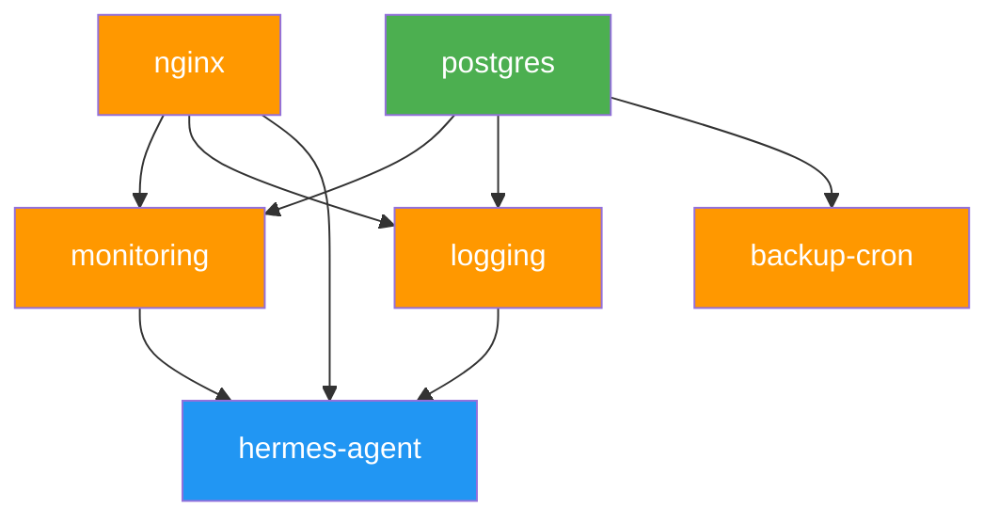

# GREP_SUMMARY: systemd, platform, service, bootstrap, deploy-modules, docker, healthcheck
# STRUCTURE: ┌systemd unit┐ → ◇ boot trigger → ○ deploy-modules.sh → ◇ healthcheck each module → ⊕ exit 0/1

# AI Platform — Systemd Unit

## Overview

The `platform.service` systemd unit runs `core/internal/bootstrap/deploy-modules.sh` on system boot,
ensuring all platform Docker containers are running after a reboot.

## Files

| File | Purpose |
|------|---------|
| `platform.service` | Systemd unit file |
| `README.md` | This documentation |

## Installation

```bash
# Copy unit file to systemd directory
sudo cp core/bootstrap/systemd/platform.service /etc/systemd/system/

# Reload systemd daemon
sudo systemctl daemon-reload

# Enable auto-start on boot
sudo systemctl enable platform.service

# Start immediately (if not already running from boot)
sudo systemctl start platform.service
```

## What It Does

1. **On boot** (`systemctl start`): Runs `core/internal/bootstrap/deploy-modules.sh` (deployed as `/opt/platform/core/bootstrap/deploy-modules.sh`)
   - Creates Docker networks (proxy-net, shared-db-net, backup-net, etc.)
   - Creates platform data directories (`/var/lib/platform/*`)
   - Authenticates to Docker Hub and GHCR (if credentials available)
   - Deploys all modules declared in `node.yaml` (system install.sh + docker compose up -d)
   - Runs healthchecks for each module

2. **On stop** (`systemctl stop`): Runs `docker compose down` for each module
   - Gracefully stops all platform containers
   - Removes compose-created networks

## Startup Ordering Guarantees

`core/internal/bootstrap/deploy-modules.sh` enforces deterministic startup order via topological sort of `module.yaml` `depends_on` chains.
Modules are deployed in parallel groups to minimize wall-clock time while respecting dependencies:

| Group | Modules | Logic | Dependencies Satisfied |
|-------|---------|-------|------------------------|
| **G1** | `postgres`, `redis` | Parallel (independent networks) | None (no `depends_on`) |
| **G2** | `monitoring`, `logging`, `backup-cron`, `nginx` | Parallel (independent modules) | `monitoring` → `postgres` (G1); `logging` → `postgres` (G1); `backup-cron` → `postgres` (G1) |
| **G3** | `hermes-agent` | Sequential (single module) | `hermes-agent` → `monitoring` + `logging` + `nginx` (G2 + system modules) |

### Dependency Graph



### module.yaml `depends_on` Chains

| Module | `depends_on` | Deploy Mechanism |
|--------|-------------|------------------|
| `nginx` | `[]` | System (`core/internal/bootstrap/install-docker.sh`) |
| `postgres` | `[]` | Docker compose |
| `redis` | `[]` | Docker compose |
| `monitoring` | `[nginx, postgres]` | Docker compose |
| `logging` | `[nginx, postgres]` | Docker compose |
| `backup-cron` | `[postgres]` | Docker compose |
| `hermes-agent` | `[nginx, monitoring, logging]` | Docker compose |

### Cross-compose depends_on

Docker Compose does **not** support `depends_on` across different compose files. Cross-compose startup
ordering (e.g., litellm → postgres, hermes-agent → litellm) is handled entirely by
`core/internal/bootstrap/deploy-modules.sh`'s topological sort. Intra-compose `depends_on` with `condition: service_healthy`
is used where services share the same compose file:

- **grafana** → `prometheus` + `loki` (both in monitoring compose)
- **alloy** → `loki` (both in logging compose)

## Dependencies

- **Docker** must be running (required by `After=docker.service` + `Requires=docker.service`)
- **Network** must be online (`Wants=network-online.target`)
- `core/internal/bootstrap/deploy-modules.sh` must be deployed to `/opt/platform/core/bootstrap/deploy-modules.sh`
- Node configuration must exist at the path expected by `deploy-modules.sh` (`$NODE_YAML`)

## Configuration

The service uses the same environment as `core/internal/bootstrap/deploy-modules.sh`:

| Variable | Purpose | Default |
|----------|---------|---------|
| `NODE_YAML` | Path to node.yaml | Required (must be set) |
| `COMPOSE_PARALLEL_LIMIT` | Max concurrent module deploys | 2 |
| `DOCKER_HUB_USERNAME` | Docker Hub auth | Anonymous if unset |
| `DOCKER_HUB_TOKEN` | Docker Hub auth token | Anonymous if unset |
| `GHCR_PULL_TOKEN` | GHCR auth token | Anonymous if unset |

**Important:** If `core/internal/bootstrap/deploy-modules.sh` requires environment variables (especially
`NODE_YAML`), set them in an environment file or systemd override:

```bash
sudo mkdir -p /etc/systemd/system/platform.service.d/
sudo cat > /etc/systemd/system/platform.service.d/env.conf << 'CONF'
[Service]
Environment=NODE_YAML=/opt/contexts/tronyx-lab/node-configs/tronyx-vps/node.yaml
Environment=COMPOSE_PARALLEL_LIMIT=4
CONF
sudo systemctl daemon-reload
```

## Logs

```bash
# Follow logs in real-time
journalctl -u platform.service -f

# Show all logs since last boot
journalctl -u platform.service -b

# Show last 50 lines
journalctl -u platform.service -n 50 --no-pager
```

## Status

```bash
sudo systemctl status platform.service
```

Expected output when healthy:
```
● platform.service - AI Platform Deploy Modules
     Loaded: loaded (/etc/systemd/system/platform.service; enabled; preset: enabled)
     Active: active (exited) since ...
   Main PID: 1234 (code=exited, status=0/SUCCESS)
```

`active (exited)` is expected for `Type=oneshot` — it means the last deploy completed
successfully. The `RemainAfterExit=yes` setting keeps the service in `active` state
until `systemctl stop` is called.

## Troubleshooting

| Symptom | Likely Cause | Fix |
|---------|-------------|-----|
| Unit stays `activating` | Docker not ready yet | Check `systemctl status docker.service` |
| Active (exited) with exit-code=1 | `deploy-modules.sh` failed for some modules | Check `journalctl -u platform.service -b \| grep "IMP:"` |
| "node.yaml not found" | NODE_YAML env not set | Add Environment=NODE_YAML=... to override |
| "must run as root" | User=root not set | Verify User=root in service file |
| Port conflict on restart | Old containers not fully stopped | Run `systemctl stop platform.service` before start |


## Docker Healthcheck

Docker daemon health monitoring is handled via `docker info` cron job defined in
`core/modules/backup-cron/scripts/crontab`. The script uses Docker's built-in health
checking with 3-consecutive-failure threshold, Telegram alerting, and automatic
restart recovery.


## Integration with make bootstrap-node

The `make bootstrap-node` command automatically:
1. Clones ai-platform to `/opt/platform/`
2. Runs `core/internal/bootstrap/deploy-modules.sh`
3. Installs this systemd unit
4. Enables auto-start on boot

To use manually:
```bash
make bootstrap-node NODE=tronyx-vps
```
