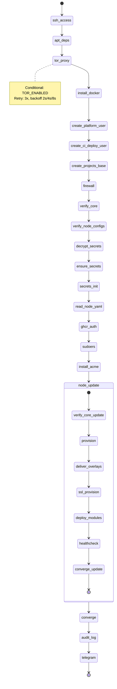

<!-- GREP_SUMMARY: AGENTS.md, bootstrap, deploy-modules, orchestration, system, docker, idempotent -->

# GREP_SUMMARY: AGENTS.md, bootstrap, deploy-modules, orchestration, system, docker, idempotent
# STRUCTURE: ┌bootstrap pipeline┐ → ◇ deploy-modules (system|docker branches) → ◇ idempotence (.done + content-hash) → ◇ artifact paths → ⎋ cross-refs
# region MODULE_CONTRACT
## @purpose  Bootstrap pipeline orchestration: node setup, module deployment, healthcheck execution
## @scope    All scripts under core/internal/bootstrap/ — node-lifecycle, deploy-modules, setup-node, install-docker, install-tor-proxy, firewall, _topo_sort, content-hash, discover_modules, remote-cmd, scp-deliver
## @invariants
##   1. node-lifecycle.sh — единственный entrypoint для bootstrap и node-update. Режимы: --mode init (полный bootstrap) и --mode update (инкрементальный update). setup-node.sh, deploy-modules.sh, firewall.sh, install-docker.sh, install-tor-proxy.sh вызываются ТОЛЬКО из node-lifecycle.sh.
##   2. deploy-modules.sh — две ветки: system (install.sh) и docker (_topo_sort + docker compose up)
##   3. Идемпотентность: .done-маркеры + per-step content-hash (content-hash.sh), не «просто повторный вызов»
##   4. Артефакты: /opt/platform/core/ (core), /opt/<context>/platform/ (context-overlay)
##   5. Никаких git-операций в bootstrap — только SCP/rsync для core; git clone/pull только через ensure_context_repo() для context-overlay
## @rationale Bootstrap — самая сложная подсистема платформы (deploy-modules.sh 560+ строк).
##            Агенты регулярно путают --modules фильтрацию, system vs docker ветки,
##            _topo_sort.py интеграцию, .done-маркеры. Единая документация сокращает ошибки.
# endregion MODULE_CONTRACT

# AGENTS.md — core/internal/bootstrap/

---

## Bootstrap pipeline

```
node-lifecycle.sh --mode init
├── 1. ssh-access           # SSH key distribution + access verification
├── 2. apt-deps             # System package dependencies
├── 3. [tor]                # Tor proxy (obfs4 bridges) for DPI bypass
├── 4. install-docker       # Docker CE installation
├── 5. user-platform        # platform system user
├── 6. user-ci-deploy       # ci-deploy user with ssh forced-command
├── 6b. projects-base       # /opt/projects base directory
├── 7. firewall             # Declarative ufw baseline
├── 8. verify-core          # Content hash verification of delivered core
├── 9. verify-node-configs  # Node config structural validation
├── 10. decrypt-secrets     # AGE-decrypt secrets from encrypted files
├── 12b. ensure-secrets     # Ensure secrets.env exists from decrypted files
├── 11. read-node-yaml      # Parse node.yaml for domain/acme/projects
├── 12. ghcr-auth           # GitHub Container Registry docker login
├── 13. sudoers             # Sudo whitelist generation
├── 13b. install-acme       # acme.sh installation (init only, via install-acme.sh)
├── 14 → node-lifecycle.sh --mode update  # provision → ssl → deploy → healthcheck
├── 16. audit-summary       # Post-init audit log
└── 17. telegram            # Notification hook

node-lifecycle.sh --mode update
├── 1. verify-core         # Content hash verification of delivered core
├── 2. provision            # Environment provision (networks + volumes)
├── 3. ssl-provision        # SSL certificate issuance via issue-cert.sh (acme.sh DNS-01)
├── 4. deploy-modules       # ALL modules (docker + system) — single call with --skip-provision
├── 5. healthcheck          # Per-module healthcheck after deploy
└── 6. converge             # Desired-state reconciler
```

⚠️ TRAP[BUG] · 2026-07-23 · P0 · FALSE DIAGNOSIS: webnames.ru zone_manager_unavailable ≠ DNS-01 broken
· Symptom: webnames.ru API returns `{"result":"ERROR","details":"zone_manager_unavailable"}` for `domains_list`.
· Reality: TXT record add/delete WORK. `zone_manager_unavailable` affects ONLY the listing endpoint.
  - add:    `{"result":"OK","details":1}`
  - delete: `{"result":"OK","details":1}`
· Proof: Wildcard cert `*.tronyx.ru` issued via LE staging 2026-07-23 with `acme.sh --dns dns_webnames`.
· Root cause of prior failure: Let's Encrypt rate-limit (50 certs/domain/week), NOT DNS API.
· Prevention: DO NOT disable DNS-01 or switch to HTTP-01 based on `domains_list` error. Verify add/delete first.
· Test: `curl "https://www.webnames.ru/scripts/json_domain_zone_manager.pl?apikey=$KEY&domain=$DOM&type=TXT&record=_acme-challenge.test:test123&action=add"`
· Rev: if add/delete also return zone_manager_unavailable → DNS-01 truly broken, HTTP-01 fallback applies.

**Вызов:** Только через `node-lifecycle.sh --mode init` или `node-lifecycle.sh --mode update`. Никогда напрямую.

---

## Режимы работы

`node-lifecycle.sh` поддерживает два режима, выбираемых через первый аргумент `--mode`:

### `--mode init` — полный bootstrap

Выполняет 17 шагов инициализации bare VPS: проверка SSH → apt-зависимости → Tor (опционально) → Docker → пользователи (platform, ci-deploy) → UFW → верификация core + node-configs → decrypt secrets → node.yaml валидация → GHCR auth → sudoers → node-update (вызов `--mode update`) → audit-log → Telegram. Идемпотентен: при повторном запуске шаги с неизменившимся content-hash пропускаются. Вызывается из `make bootstrap-node` через `core/entrypoints/bootstrap.sh`.

### `--mode update` — инкрементальный update

Выполняет 5 шагов на уже забутстрапленной ноде: verify-core (content-hash) → provision (networks + volumes) → issue-cert.sh (acme.sh DNS-01 wildcard cert) → deploy-modules (docker + system одним вызовом с --skip-provision) → healthcheck. S2 DevPlan 024: шаги deploy docker + deploy system объединены в один вызов deploy-modules.sh, устранён повторный полный проход main(). Оптимизирован для CI: ~5 мин вместо ~30 мин полного bootstrap. Вызывается из `make node-update` через `core/entrypoints/node-update.sh`, а также из step-14 init-режима (post-init update).

---

## deploy-modules.sh — две ветки

`deploy-modules.sh` обрабатывает два типа модулей, декларированных в `node.yaml`:

### system-модули
- Устанавливаются через install.sh в директории модуля
- Поддерживаются через `deploy_system_module()`:
  - `systemctl daemon-reload && systemctl enable --now <service>`
  - healthcheck: `healthcheck.sh` (liveness или deep mode)
- Примеры: nginx (системная установка)

### docker-модули
- Развёртываются через Docker Compose
- **Два режима** (feature flag `DEPLOY_PARALLEL`, default=false):
  - **Последовательный** (`DEPLOY_PARALLEL=false`, обратная совместимость):
    `_topo_sort.py` (сортировка по depends_on) → `docker compose pull` → `docker compose up -d`
  - **Параллельный** (`DEPLOY_PARALLEL=true`, DevPlan 050):
    `_topo_sort.py` → batch-metadata + batch-check-env → pre-pull (parallel_limit=4) → итерация по topo-группам →
    `deploy_docker_group()` (os.fork per module, content-hash skip для build-модулей) →
    parallel healthcheck внутри группы → severity-based exit
- Healthcheck: `docker inspect` → `State.Health.Status` (liveness) или `healthcheck.sh MODE=deep`
- При параллельном режиме healthcheck выполняется внутри `deploy_docker_group()`, маркер `/var/lib/platform/.bootstrap/.hc_done_in_deploy` предотвращает дублирование в node-lifecycle
- Content-hash skip (status-page, backup-cron): `content_hash.py` кэширует SHA256 исходников → пропускает `docker compose build` при совпадении
- Примеры: postgres, redis, litellm, langfuse, hermes-agent, status-page, backup-cron

### Фильтрация --modules
- `deploy-modules.sh --modules postgres,redis` → развернуть только указанные
- Без флага → все модули из `node.yaml`
- Фильтрация применяется ДО topo-sort — зависимости не резолвятся автоматически (зависимый модуль без зависимости = fail)

---

## Идемпотентность (state.json + name-based keys)

**Механизм:** `checkpoint_migration.py` + `state.json` в `/var/lib/platform/.bootstrap/state.json`

| Механизм | Где | Что делает |
|----------|-----|------------|
| `state.json` (name-based keys) | `/var/lib/platform/.bootstrap/state.json` | Единый source of truth для checkpoint'ов. Ключи — имена шагов Python (underscores). Shell маппит свои hyphen-имена через `checkpoint_migration.py::SHELL_TO_PYTHON_STEP`. (DevPlan 071 Rev 2) |
| content-hash | `content-hash.sh` (shell) / `state_machine._step_hash()` (Python) | Хеширует содержимое скриптов для idempotency. Shell hash пишется в state.json через `checkpoint_migration.py`, Python проверяет через `_hash_changed()`. |

**Пример:** `checkpoint_step "ssh-access" step_1_ssh_access` → `checkpoint_migration.py mark-done` пишет `{"ssh_access": {"status": "done"}}` в state.json. Повторный запуск с `--resume` видит `ssh_access.done` → no-op.

**Миграция:** При первом запуске после обновления `checkpoint_migrate_legacy()` импортирует старые `.done`-файлы из `/var/lib/platform/.bootstrap-checkpoints/` в name-based state.json. После миграции `.done`-файлы удаляются. (DevPlan 071 Rev 2)

**Сброс:** `python3 core/internal/checkpoint_migration.py reset /var/lib/platform/.bootstrap/state.json` или `make bootstrap-node ... --force` → следующий bootstrap будет полным.

---

## Артефакты

| Путь | Содержимое | Доставка |
|------|-----------|----------|
| `/opt/platform/core/` | core/ файлы (entrypoints, internal, lib, modules) | SCP/rsync push (core-deploy CI) |
| `/opt/<context>/platform/` | Context-overlay (ayaml, node-configs, кастомизации) | git clone/pull (ensure_context_repo()) |
| `/opt/platform/secrets/` | AGE-encrypted secrets | SCP (через decrypt-secrets.sh) |

---

---

### Lifecycle State Machine (W5-E6)



### SSL Cert Lifecycle Unification (DevPlan 052)

**Мотивация:** Bug-репорт 2026-07-25: сертификаты выпускались и сайты работали, но при повторном bootstrap не восстанавливались из S3. Корневая причина: (а) `_ssl_provision()` не прокидывала S3_* креды в subprocess — s3-ssl-cache.sh upload/download молча падали; (б) cert_orchestrator пропускал platform domain (cert на диске) — upload в S3 не вызывался.

**Архитектура (DevPlan 052 Phase 1-3):**

| Компонент | Назначение | Взаимодействие |
|-----------|-----------|----------------|
| `s3_ssl_cache.py` (NEW) | Python-порт s3-ssl-cache.sh — upload/download/check/bulk-restore через boto3 | Прямой импорт в cert_orchestrator.py (без subprocess). os.environ доступ решает проблему credential propagation. |
| `s3-ssl-cache.sh` (REDUCED) | CLI-фасад ~30 строк | Парсинг аргументов + вызов python3 s3_ssl_cache.py. Только для обратной совместимости (issue-cert.sh --reloadcmd). |
| `cert_orchestrator.py` (MODIFIED) | Unified SSL entrypoint | Прямой импорт s3_ssl_cache, upload-on-skip (cert на диске → upload в S3), upload после успешного issue. |
| `state_machine.py` (MODIFIED) | `_ssl_provision_via_orchestrator()` | Вызывает cert_orchestrator.orchestrate_certs() для ALL domains (platform + projects). |

**Ключевые изменения:**

1. **Restore-first:** `_process_single_domain()` → check disk → check S3 → issue-cert.sh. Восстановление из S3 без acme.sh API вызова.
2. **Upload-on-skip:** При существующем сертификате на диске — upload в S3 (платформенный домен теперь всегда в кеше).
3. **acme.sh --reloadcmd:** Добавлен вызов `python3 s3_ssl_cache.py upload $domain` после reload nginx — S3 синхронизация при каждом cron renewal.
4. **acme.sh --renew-hook:** `_acme_install_cron()` устанавливает `--renew-hook` с вызовом s3_ssl_cache.py upload — гарантирует S3 backup после автоматического обновления.

**Pipeline flow (after DevPlan 052):**

```
UPDATE mode:
  → ssl_provision: cert_orchestrator.orchestrate_certs(ALL domains)
      ├── disk check → upload (synced) / S3 check → download restore / issue-cert → upload
      └── Все домены обработаны restore-first в Python-процессе
  → deploy_context: cert_orchestrator.orchestrate_certs(ALL domains)
      ├── disk check → upload (synced) — второй вызов idempotent
      └── S3 синхронизирован для всех доменов

CRON:
  acme.sh --cron → renew cert → --reloadcmd (nginx reload + s3_ssl_cache upload)
  → --renew-hook (s3_ssl_cache upload с $Le_Domain) — двойная страховка
```

### Shell-фасады: сводка

| Скрипт | До (LOC) | После (LOC) | Сокращение |
|--------|----------|-------------|------------|
| `deploy-modules.sh` | 1664 | 91 | 95% |
| `converge.sh` | 1149 | 137 | 88% |
| `node-lifecycle.sh` | 1301 | 164 | 87% |
| **Итого** | **4114** | **392** | **90%** |

Inline `python3 -c` / `<<PYEOF` в фасадах: 0 (было 31 в топ-3). Все inline-блоки мигрированы в Python-функции с unit-тестами.

### Unit-тесты

Все модули имеют unit-тесты в `tests/unit/`:

- `tests/unit/test_docker_orchestrator.py`
- `tests/unit/test_sudoers_generator.py`
- `tests/unit/test_context_overlay.py`
- `tests/unit/test_secrets_validator.py`
- `tests/unit/test_orphan_reconciler.py`
- `tests/unit/test_reconciler.py`
- `tests/unit/test_state_machine.py`
- `tests/unit/test_s3_ssl_cache.py` (NEW — DevPlan 052 Phase 3)
- `tests/unit/test_cert_upload_on_skip.py` (NEW — DevPlan 052 Phase 3)

---

## Cross-references

| Файл | Назначение |
|------|-----------|
| [`../../../core/AGENTS.md`](../../AGENTS.md) | Канонические операции, структура слоёв, forbidden-списки |
| [`../../../AGENTS.md`](../../../AGENTS.md) | Архитектурные инварианты, модель деплоя, dual delivery |
| [`../../../core/entrypoint-manifest.yaml`](../../entrypoint-manifest.yaml) | YAML-реестр операций (bootstrap-node в секции bootstrap) |
